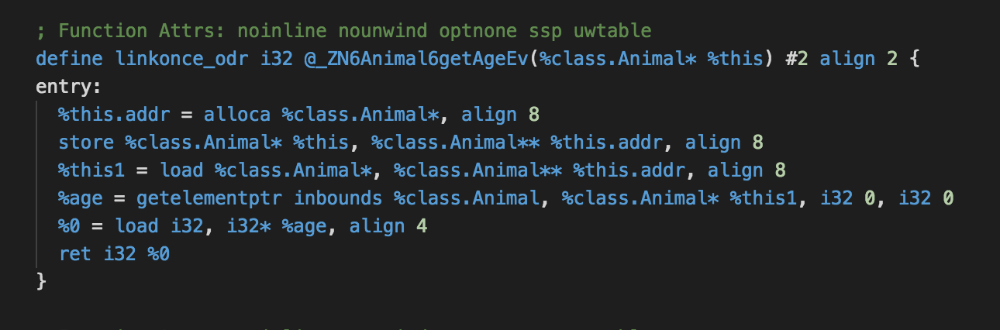
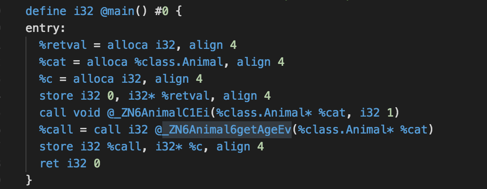
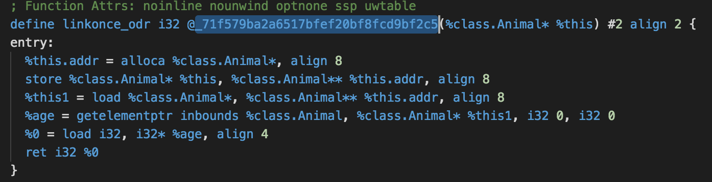
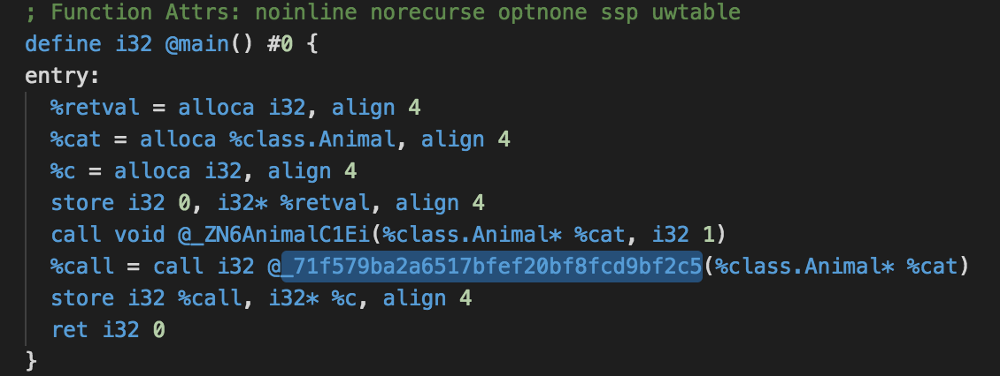
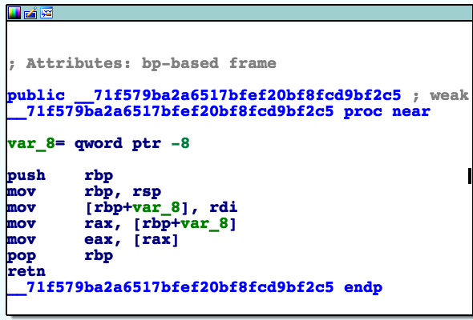

# replace_function_name

### 主要功能

LLVM生成IR时使用md5替换函数名

### 构建

clone仓库，将replace文件夹放到任意位置，并设置replace路径为环境变量REPATH


```
git clone https://github.com/penguin-wwy/replace_function_name.git
cd replace_function_name
mv replace /Users/home/
```

添加环境变量

```
export REPATH=/Users/home/replace
```

```
mkdir ../build
cd ../build
cmake ../replace_function_name
make -j 4
```

编译完成后使用该目录下./bin/clang编译需要混淆的文件或工程

### 使用方法

首先打开replace下的1.code，没有则创建

输入如下内容

```
1
ClassName:FucntionName1
ClassName:FucntionName2
:FunctionName
...
```

第一行设置为1，不使用函数名替换设置为0即可

除第一行外格式为类名(非成员函数可省略) + 冒号 + 函数名，

暂时不支持构造函数、析构函数、与成员函数同名的非成员函数。

之后编译工程或文件

完成后执行replace文件夹下的replace.py脚本

成功后再执行第二次编译即可

### 效果

替换前





替换后






